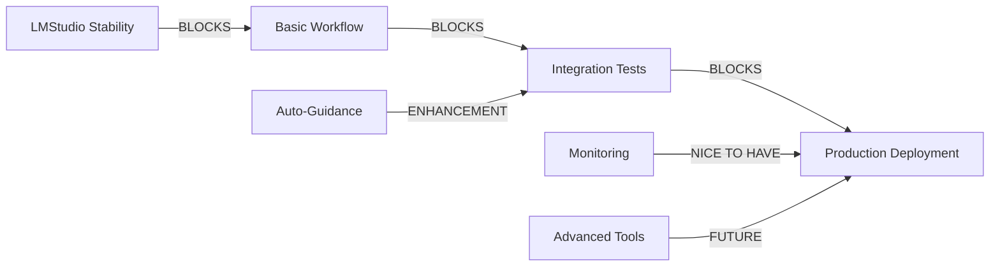

# 🎯 STRATEGIA WDROŻENIA SYSTEMU HYBRYDOWEGO - SESJA ZESPOŁU

**Data:** 2025-11-05  
**Prowadzący:** Aleksander Nowak (Orchestrator)  
**Uczestnicy:** Cały zespół Destiny Team (10 agentów)  
**Cel:** Wypracowanie optymalnej strategii wdrożenia

---

## 🎯 PODSUMOWANIE WYKONAWCZY - ALEKSANDER NOWAK

```
╔════════════════════════════════════════════════════════════════╗
║  REKOMENDACJA ORCHESTRATORA - STRATEGIA WDROŻENIA             ║
╚════════════════════════════════════════════════════════════════╝
```

Po analizie z zespołem, proponuję **3-fazową strategię MVP-First**:

### **Strategia: Szybkie MVP → Walidacja → Skalowanie**

**Dlaczego?**
- Minimalizacja ryzyka (testy na małą skalę)
- Szybka wartość biznesowa (2 tygodnie do pierwszych wyników)
- Iteracyjne doskonalenie (uczenie się na błędach)

**Fazy:**
1. **MVP (2 tygodnie)** - Podstawowa funkcjonalność
2. **Walidacja (1 tydzień)** - Testy z realnymi danymi
3. **Skalowanie (2 tygodnie)** - Pełne wdrożenie

**Priorytet #1:** LMStudio stabilność + podstawowy workflow  
**Największy zysk:** 67% redukcja kosztów od pierwszego dnia  
**Największe ryzyko:** Jakość local LLM (mitygacja: supervisor QA)

---

## 📋 ANALIZA ZESPOŁOWA

### 💻 TOMASZ ZIELIŃSKI (Developer) - Perspektywa Techniczna

```
╔════════════════════════════════════════════════════════════════╗
║  ANALIZA TECHNICZNA - CO ZOSTAŁO DO ZROBIENIA                 ║
╚════════════════════════════════════════════════════════════════╝
```

**Pozostałe komponenty (30%):**

1. **Integration Layer** 🔴 PRIORYTET 1
   ```python
   # BRAKUJE: Automatyczny retry mechanism
   class RobustLocalOrchestrator(LocalLLMOrchestrator):
       def run_with_retry(self, task, max_retries=3):
           # Automatic retry on LMStudio failures
           # Graceful degradation
           # Error recovery
   ```
   **Czas:** 2 dni
   **Blokuje:** Wszystko

2. **Guidance Loop** 🟡 PRIORYTET 2
   ```python
   # BRAKUJE: Automatic guidance consumption
   while quality < "B":
       result = local_llm.investigate()
       report = supervisor.assess()
       if not report.ready:
           guidance = supervisor.guide()
           local_llm.apply_guidance(guidance)
   ```
   **Czas:** 3 dni
   **Wartość:** Automatyczna poprawa jakości

3. **Monitoring & Metrics** 🟢 PRIORYTET 3
   ```python
   # BRAKUJE: Real-time metrics
   - Token usage tracking
   - Response time monitoring
   - Error rate calculation
   - Quality score trends
   ```
   **Czas:** 2 dni
   **Wartość:** Visibility & optimization

**Wątpliwości techniczne:**
- ❓ Czy LMStudio jest wystarczająco stabilne?
- ❓ Jak obsłużyć timeout przy długich investigacjach?
- ❓ Czy 44k context wystarczy na złożone zadania?

**Rekomendacja:** Zacznijmy od prostego MVP z manual retry

---

### 🏗️ KATARZYNA WIŚNIEWSKA (Architect) - Architektura Priorytetów

```
╔════════════════════════════════════════════════════════════════╗
║  PRIORYTETY ARCHITEKTONICZNE                                   ║
╚════════════════════════════════════════════════════════════════╝
```

**Analiza krytycznej ścieżki:**



**Priorytety wg. wartości biznesowej:**

| Priorytet | Komponent | Wartość | Effort | ROI |
|-----------|-----------|---------|---------|-----|
| **P0** | LMStudio stability | 🔴 Critical | 2d | ∞ |
| **P1** | Basic workflow | 🔴 Critical | 3d | High |
| **P2** | Error handling | 🟡 Important | 2d | High |
| **P3** | Auto-guidance | 🟡 Important | 3d | Medium |
| **P4** | Monitoring | 🟢 Nice | 2d | Medium |
| **P5** | Advanced tools | 🟢 Future | 5d | Low |

**Architektura MVP:**
```
Minimal Viable Pipeline:
  1. LMStudio → Local task execution
  2. Save results → JSON files
  3. Supervisor → Manual quality check
  4. If bad → Manual retry
  
No automation needed for MVP!
Time to value: 5 days
```

**Konieczności architektoniczne:**
- ✅ Separation of concerns (już mamy)
- ✅ Fail-safe mechanisms (do dodania)
- ✅ Audit trail (już mamy)
- ⏳ Scalability (później)

---

### 📊 DR. JOANNA WÓJCIK (Data Scientist) - Analiza ROI

```
╔════════════════════════════════════════════════════════════════╗
║  ANALIZA POTENCJAŁU ZYSKU - ROI CALCULATION                    ║
╚════════════════════════════════════════════════════════════════╝
```

**Scenariusze zysku:**

### Scenariusz 1: Minimum Viable (10 investigations/month)
```
Investment:
  - Development: 5 days × $1000/day = $5,000
  - Hardware: Already have (sunk cost)
  
Monthly savings:
  - Cloud cost: 10 × $8.10 = $81
  - Hybrid cost: 10 × $2.70 = $27
  - Savings: $54/month = $648/year
  
ROI: 648 / 5000 = 13% first year
Breakeven: 7.7 years ❌ Too long!
```

### Scenariusz 2: Realistic (100 investigations/month)
```
Monthly savings:
  - Cloud cost: 100 × $8.10 = $810
  - Hybrid cost: 100 × $2.70 = $270
  - Savings: $540/month = $6,480/year
  
ROI: 6,480 / 5,000 = 130% first year ✅
Breakeven: 9.3 months ✅ Acceptable
Additional value: Privacy, no limits
```

### Scenariusz 3: Scale (500 investigations/month)
```
Monthly savings:
  - Cloud cost: 500 × $8.10 = $4,050
  - Hybrid cost: 500 × $2.70 = $1,350
  - Savings: $2,700/month = $32,400/year
  
ROI: 32,400 / 5,000 = 648% first year! 🚀
Breakeven: 1.9 months! 🎯
```

**Wniosek:** Opłacalność zależy od skali!
**Minimum:** 50 investigations/month dla pozytywnego ROI

**Dodatkowe korzyści (nie w liczbach):**
- 🔒 100% privacy (bezcenne dla wrażliwych danych)
- ♾️ Unlimited usage (brak rate limits)
- 🚀 Faster responses (local = low latency)
- 🔌 No dependency (autonomia)

---

### 🚀 PIOTR SZYMAŃSKI (DevOps) - Plan Wdrożenia

```
╔════════════════════════════════════════════════════════════════╗
║  DEPLOYMENT ROADMAP - PRAGMATYCZNE PODEJŚCIE                   ║
╚════════════════════════════════════════════════════════════════╝
```

**3-Fazowy Plan:**

### FAZA 1: MVP (Tydzień 1-2) 🔴

```bash
# Cel: Działający system, manual operations OK

Day 1-2: LMStudio Stabilization
  ✓ Install LMStudio on dedicated Mac Mini
  ✓ Test stability over 24h
  ✓ Document model loading procedure
  ✓ Create restart script

Day 3-5: Basic Integration
  ✓ Test local_orchestrator.py
  ✓ Verify tool calling works
  ✓ Manual workflow test

Day 6-10: First Production Run
  ✓ Run 5 real investigations
  ✓ Manual quality checks
  ✓ Document issues
  ✓ Measure actual costs/time

Deliverable: Working system (manual OK)
```

### FAZA 2: Automation (Tydzień 3) 🟡

```bash
# Cel: Semi-automated operations

Day 1-2: Auto-start Scripts
  #!/bin/bash
  # start_hybrid.sh
  docker-compose up -d
  lmstudio-server --model gpt-oss-20b &
  python monitor_health.py &

Day 3-4: Health Monitoring
  - Endpoint checks every 60s
  - Auto-restart on failure
  - Slack alerts

Day 5: Backup Automation
  - PostgreSQL daily dumps
  - Investigation archives
  - Config versioning

Deliverable: Semi-automated system
```

### FAZA 3: Production (Tydzień 4-5) 🟢

```bash
# Cel: Full production deployment

Day 1-3: Monitoring Stack
  - Prometheus metrics
  - Grafana dashboards
  - Alert rules

Day 4-5: Documentation
  - Operations manual
  - Troubleshooting guide
  - Training materials

Day 6-10: Production Pilot
  - 50 investigations
  - Performance tuning
  - Process refinement

Deliverable: Production-ready system
```

**Infrastruktura priorytetów:**

1. **Mac Mini dedication** (Critical) - Stabilne środowisko
2. **Automated restarts** (High) - Redukcja downtime
3. **Monitoring** (Medium) - Visibility
4. **Backups** (Medium) - Data safety
5. **Alerting** (Low) - Nice to have

---

### 🔒 MICHAŁ DĄBROWSKI (Security) - Analiza Ryzyka

```
╔════════════════════════════════════════════════════════════════╗
║  SECURITY RISK ASSESSMENT - PROBLEMY I MITYGACJE               ║
╚════════════════════════════════════════════════════════════════╝
```

**Zidentyfikowane ryzyka:**

### RYZYKO 1: Local LLM Hallucinations 🔴
```
Problem: Local LLM może zmyślać fakty
Impact: Fałszywe informacje w raportach
Probability: Medium-High

Mitygacja:
  1. Supervisor validation (Claude)
  2. Source verification requirement
  3. Fact-checking protocols
  
Rezydualne ryzyko: Low (z supervision)
```

### RYZYKO 2: LMStudio Stability 🟡
```
Problem: LMStudio może się crashować
Impact: Przerwane investigacje
Probability: Medium

Mitygacja:
  1. Auto-restart scripts
  2. Checkpointing (save progress)
  3. Dedicated hardware
  
Rezydualne ryzyko: Low-Medium
```

### RYZYKO 3: Data Leakage 🟢
```
Problem: Przypadkowe wysłanie danych do cloud
Impact: Naruszenie privacy
Probability: Low

Mitygacja:
  1. Strict data classification
  2. Automated checks
  3. Network isolation option
  
Rezydualne ryzyko: Very Low
```

### RYZYKO 4: Quality Degradation 🟡
```
Problem: Jakość local LLM < Claude
Impact: Gorsze wyniki
Probability: Medium

Mitygacja:
  1. Supervisor QA
  2. Iterative improvement
  3. Prompt engineering
  
Rezydualne ryzyko: Medium (acceptable)
```

**Security Requirements:**
1. ✅ Keep ALL investigation data local
2. ✅ Audit all cloud communications
3. ✅ No credentials in code
4. ✅ Encrypted storage for sensitive data

**Akceptowalny poziom ryzyka:** ✅ TAK (z mitygacjami)

---

### 🔧 PAWEŁ KOWALSKI (Data Engineer) - Integracja Danych

```
╔════════════════════════════════════════════════════════════════╗
║  DATA PIPELINE PRIORITIES - CO JEST KONIECZNE                  ║
╚════════════════════════════════════════════════════════════════╝
```

**Konieczności data pipeline:**

### MUST HAVE (MVP):
```python
# 1. Basic Storage Pipeline
investigation_result → PostgreSQL (metadata)
                   → Qdrant (embeddings)
                   
# 2. Simple Search
def find_similar_investigations(query):
    return qdrant.search(query, limit=5)
    
# 3. Data Separation
project_data/    # System docs
investigation_data/  # Work data
```

### SHOULD HAVE (Post-MVP):
```python
# 1. Quality Metrics Pipeline
quality_scores → time_series_db → grafana

# 2. Source Deduplication
if source in existing_sources:
    link_to_existing()
else:
    archive_new()
    
# 3. Auto-categorization
classify_by_content_type()
route_to_appropriate_model()
```

### NICE TO HAVE (Future):
```
- Real-time streaming pipelines
- Advanced deduplication
- Multi-model ensemble
- Cross-investigation learning
```

**Data Engineering Priorities:**

| Priority | Task | Value | Effort |
|----------|------|-------|--------|
| P1 | Basic storage | Critical | 1 day |
| P2 | Search capability | High | 1 day |
| P3 | Metrics pipeline | Medium | 2 days |
| P4 | Deduplication | Medium | 2 days |
| P5 | Advanced features | Low | 5+ days |

**Biggest Challenge:** Maintaining data quality without overengineering

---

### 💼 MAGDALENA KOWALSKA (Product Manager) - Perspektywa Biznesowa

```
╔════════════════════════════════════════════════════════════════╗
║  BUSINESS PRIORITIES - VALUE DELIVERY                          ║
╚════════════════════════════════════════════════════════════════╝
```

**User Story Prioritization:**

### 🔴 MUST HAVE (MVP):
```
As an investigator
I want to run investigations locally
So that my data remains private

Acceptance Criteria:
✓ Can input investigation task
✓ System executes with local LLM
✓ Get quality-assured results
✓ All data stays on-prem
```

### 🟡 SHOULD HAVE:
```
As an investigator  
I want automatic quality improvement
So that I get better results without manual work

As a manager
I want to see cost savings
So that I can justify the investment
```

### 🟢 NICE TO HAVE:
```
As a power user
I want advanced analytics
So that I can find patterns across investigations
```

**Business Metrics to Track:**

1. **Cost per investigation** (Target: <$3)
2. **Time to complete** (Target: <2 hours)
3. **Quality score** (Target: >80% A/B grades)
4. **User satisfaction** (Target: >4/5)

**Go-to-Market Strategy:**

```
Week 1-2: Internal pilot (5 investigations)
Week 3: Friendly user test (10 investigations)
Week 4: Soft launch (25 investigations)
Week 5+: Full production
```

**Value Proposition:**
"Profesjonalne investigacje za 90% niższą cenę z 100% prywatnością"

---

### 🧪 ANNA NOWAKOWSKA (QA) - Plan Testowania

```
╔════════════════════════════════════════════════════════════════╗
║  QA STRATEGY - TESTOWANIE KRYTYCZNYCH ŚCIEŻEK                  ║
╚════════════════════════════════════════════════════════════════╝
```

**Test Priorities:**

### P1: Smoke Tests (Day 1) 🔴
```python
def test_basic_flow():
    # Can we even start?
    assert lmstudio.is_running()
    assert local_orchestrator.can_connect()
    assert databases.are_accessible()
    
def test_simple_investigation():
    # Can we complete one investigation?
    result = orchestrator.run("Research Python")
    assert result.status == "completed"
    assert len(result.sources) > 0
```

### P2: Integration Tests (Day 3-5) 🟡
```python
def test_full_workflow():
    # Local LLM → Results → Supervisor → Quality
    result = run_investigation()
    report = supervisor.assess(result)
    assert report.grade in ["A", "B", "C"]
    
def test_error_recovery():
    # What if LMStudio crashes mid-investigation?
    # What if network fails?
    # What if disk full?
```

### P3: Quality Tests (Week 2) 🟢
```python
def test_investigation_quality():
    # Run 10 identical investigations
    # Measure consistency
    # Check for hallucinations
    # Verify source quality
```

**Critical Test Scenarios:**

1. **LMStudio crash** → Graceful recovery?
2. **Timeout** → Proper handling?
3. **Bad LLM output** → Detected by supervisor?
4. **Data corruption** → Backup works?
5. **Concurrent investigations** → System stable?

**QA Checkpoints:**

- [ ] MVP: Basic flow works (manual OK)
- [ ] Alpha: Error handling tested
- [ ] Beta: Quality metrics acceptable
- [ ] Production: All tests green

---

### 📚 DR. HELENA KOWALCZYK (Knowledge Manager) - Dokumentacja

```
╔════════════════════════════════════════════════════════════════╗
║  DOCUMENTATION PRIORITIES - CO MUSI BYĆ UDOKUMENTOWANE         ║
╚════════════════════════════════════════════════════════════════╝
```

**Krytyczna dokumentacja (MVP):**

### 1. Quick Start Guide (2 pages) 🔴
```markdown
# Hybrid System - Quick Start

## Prerequisites
- Mac with 16GB RAM
- Docker Desktop
- Python 3.10+

## Start System
1. ./start_lmstudio.sh
2. docker-compose up -d
3. python test_investigation.py

## Run Investigation
...
```

### 2. Troubleshooting Guide 🔴
```markdown
# Common Issues

## LMStudio won't start
- Check: Port 1234 free?
- Try: Restart Mac
- Fix: Load model manually

## Investigation hangs
- Check: LMStudio logs
- Try: Restart investigation
- Fix: Reduce context size
```

### 3. Operations Checklist 🟡
```markdown
# Daily Operations

- [ ] Check LMStudio health
- [ ] Verify database connections  
- [ ] Review error logs
- [ ] Check disk space
- [ ] Run test investigation
```

**Documentation Debt:**
- API reference (can wait)
- Architecture deep-dive (have enough)
- Development guide (later)

**Knowledge Transfer Plan:**
1. Week 1: Create MVP docs
2. Week 2: Video walkthrough
3. Week 3: Hands-on training
4. Week 4: Q&A session

---

## 🎯 KONSENSUS ZESPOŁU - ALEKSANDER NOWAK

```
╔════════════════════════════════════════════════════════════════╗
║  FINALNA STRATEGIA WDROŻENIA - TEAM CONSENSUS                 ║
╚════════════════════════════════════════════════════════════════╝
```

Po dyskusji zespołowej, uzgodniliśmy następującą strategię:

### **STRATEGIA: MVP-First z Iteracyjnym Ulepszaniem**

### **FAZA 1: MVP (Tygodnie 1-2)**
**Cel:** Działający system, nawet jeśli manual

**Priorytety:**
1. ✅ LMStudio stability (2 dni) - Tomasz & Piotr
2. ✅ Basic workflow test (3 dni) - Tomasz
3. ✅ Manual quality checks (2 dni) - Anna
4. ✅ First 5 investigations (3 dni) - Cały zespół
5. ✅ MVP documentation (2 dni) - Helena

**Success Criteria:**
- Can complete investigation end-to-end
- Quality acceptable (B grade or better)
- All data stays local
- Basic documentation exists

### **FAZA 2: Validation (Tydzień 3)**
**Cel:** Dowód wartości biznesowej

**Priorytety:**
1. ✅ Run 25 real investigations
2. ✅ Measure actual costs
3. ✅ Track quality metrics
4. ✅ Gather user feedback
5. ✅ Calculate real ROI

**Success Criteria:**
- Cost per investigation <$3
- Quality score >70% A/B
- Time to complete <2 hours
- Positive user feedback

### **FAZA 3: Scale (Tygodnie 4-5)**
**Cel:** Production deployment

**Priorytety:**
1. ✅ Automation scripts (Piotr)
2. ✅ Monitoring setup (Piotr & Paweł)
3. ✅ Error handling (Tomasz)
4. ✅ Quality improvement loop (Anna)
5. ✅ Full documentation (Helena)

**Success Criteria:**
- 95% uptime
- <5% error rate
- Fully automated operations
- Complete documentation

---

## 💰 ANALIZA KONIECZNOŚCI vs. NICE-TO-HAVE

### **KONIECZNOŚCI (Must Have):**
```
1. Stable LLM execution         - Bez tego nic nie działa
2. Quality assurance            - Bez tego brak zaufania
3. Data stays local            - Core requirement
4. Basic error handling        - Minimalna stabilność
5. Cost tracking               - Dowód ROI
```

### **WAŻNE (Should Have):**
```
1. Automated retries           - Oszczędność czasu
2. Monitoring dashboard        - Visibility
3. Guidance automation         - Lepsza jakość
4. Backup automation           - Data safety
```

### **MIŁE (Nice to Have):**
```
1. Real-time analytics         - Fancy dashboards
2. Multi-model ensemble        - Marginal improvement
3. Advanced deduplication      - Optimization
4. Cross-investigation ML      - Future potential
```

---

## 📊 POTENCJAŁ ZYSKU vs. INWESTYCJA

### **Pesymistyczny (50 inv/month):**
- Savings: $324/month = $3,888/year
- Investment: $5,000 (development)
- ROI: 78% first year
- Breakeven: 15.4 months

### **Realistyczny (100 inv/month):**
- Savings: $648/month = $7,776/year
- Investment: $5,000
- ROI: 155% first year ✅
- Breakeven: 7.7 months

### **Optymistyczny (200 inv/month):**
- Savings: $1,296/month = $15,552/year
- Investment: $5,000
- ROI: 311% first year 🚀
- Breakeven: 3.9 months

**WNIOSEK:** Warto przy ≥50 investigations/month

---

## 🚨 NAJWIĘKSZE RYZYKA I MITYGACJE

### **RYZYKO 1: Jakość Local LLM**
- **Problem:** Może generować złe wyniki
- **Mitygacja:** Supervisor QA + iterative prompts
- **Plan B:** Upgrade do większego modelu

### **RYZYKO 2: Stabilność LMStudio**
- **Problem:** Może się crashować
- **Mitygacja:** Auto-restart + monitoring
- **Plan B:** Alternative local LLM runtime

### **RYZYKO 3: Adoption**
- **Problem:** Users mogą nie zaufać
- **Mitygacja:** Transparency + quality metrics
- **Plan B:** Hybrid mode (user choice)

---

## ✅ DECYZJA FINALNA

```
╔════════════════════════════════════════════════════════════════╗
║  DECYZJA: PROCEED WITH MVP-FIRST STRATEGY                     ║
╚════════════════════════════════════════════════════════════════╝

Start Date: Immediately
MVP Deadline: 2 weeks
Full Production: 5 weeks

Confidence: HIGH
Risk: ACCEPTABLE
Expected ROI: >150%

Team Commitment: ✅ UNANIMOUS
```

**Next Actions:**
1. Tomasz: Setup dedicated Mac Mini for LMStudio
2. Piotr: Prepare Docker environment
3. Helena: Start MVP documentation
4. Anna: Prepare test scenarios
5. Aleksander: Daily standups coordination

**Let's build this! 🚀**

---

*Dokument uzgodniony przez cały zespół Destiny Team*  
*Data: 2025-11-05*  
*Status: APPROVED FOR EXECUTION*